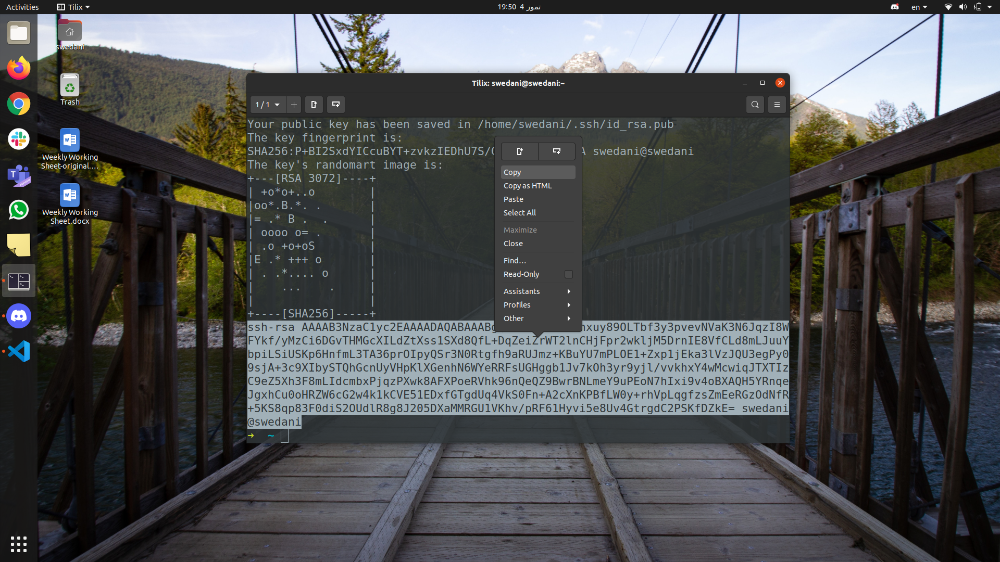
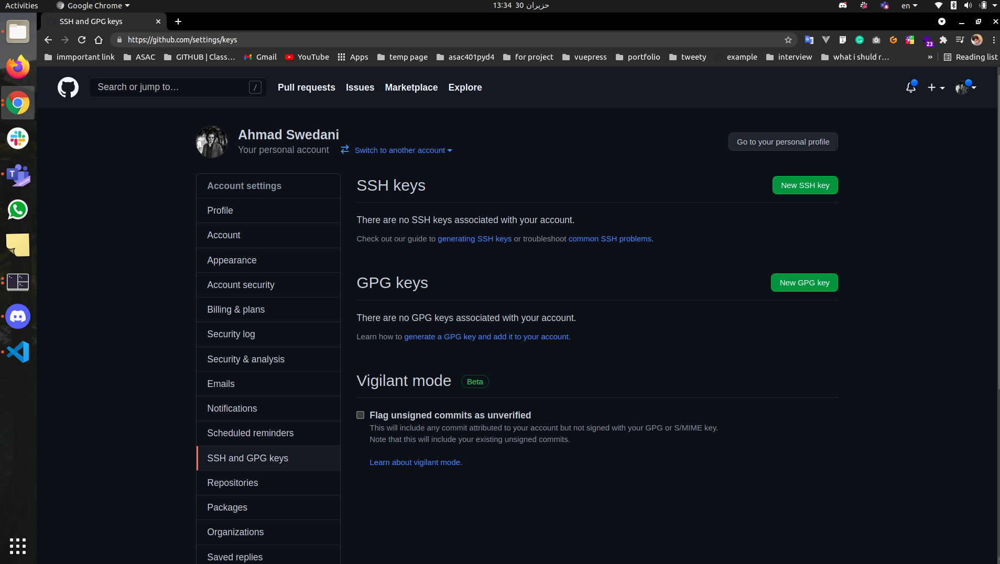
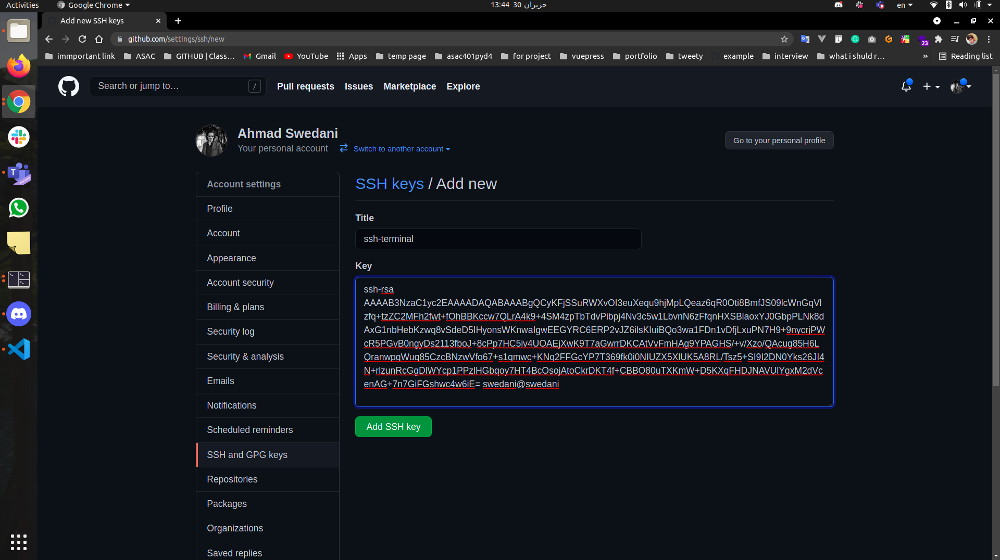
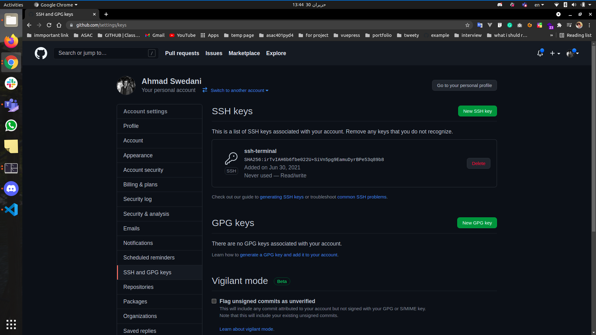

# SSH-Github

A  guide on how to add an SSH key to your github account. [Original Author](https://github.com/ahmad-swedani)

___

## _Credit_

This guide was authored and created by [Ahmad Swedani](https://github.com/ahmad-swedani)

You can find the __original__ document [here](https://github.com/ahmad-swedani/SSH-GitHub)

___

## setup SSH keys

### Terminal part

1- First open the terminal:

2- Create new SSH key using this command and press enter three times, and copy the key

```bash
cd && ssh-keygen && cat ~/.ssh/id_rsa.pub
```



### GitHub part

1- Open [GitHub setting Keys](https://github.com/settings/keys)



2- Click on `New SSH key` you will see this result:


3- Write `ssh-terminal` in the title section

4- Paste the key that we copied before in the Key section



5- Click on `Add SSH key` you will see this result:



___

### Enjoy using SSH no password any more 😎 🥳

> clone with SSH URL

___

### `Important`: to change the remote from Https to SSH

open your repo and run this command

```bash
git remote set-url origin SSH-URL
```

### Done
